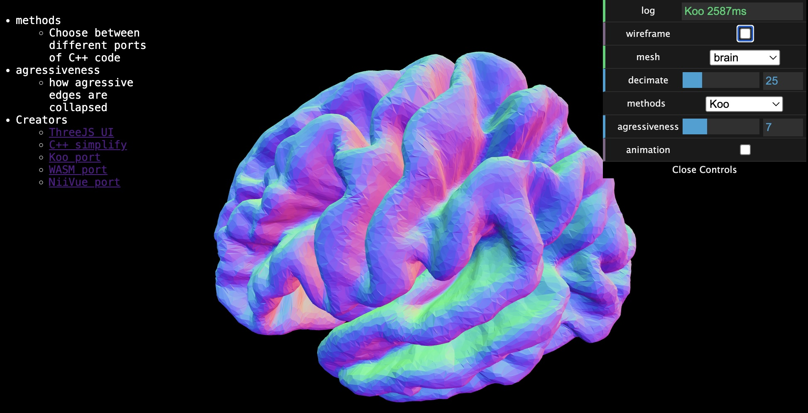

## Mesh Simplification

This repository provides different variations of Sven Forstmann's mesh simplification method. The [live demo web page](https://neurolabusc.github.io/simplifyjs/) allows users to interactively adjust parameters. Several ports are provided: the pure JavaScript NiiVue method is fast but does not support [UV Mapping](https://en.wikipedia.org/wiki/UV_mapping). The pure JavaScript Koo and WebAssembly (WASM) methods support UV mapping, with the latter being faster.



## Serve locally

```
git clone https://github.com/neurolabusc/simplifyjs
cd simplifyjs
python -m http.server 8080
```

## Links

 - This project extends Tim Knip's [mesh-decimate](https://github.com/timknip/mesh-decimate) demo. 
 - All ports based on Sven Forstmann's C++ [Fast Quadric Mesh Simplification](https://github.com/sp4cerat/Fast-Quadric-Mesh-Simplification).
 - Pure JavaScript port by [Joshua Koo](https://gist.github.com/zz85/a317597912d68cf046558006d7647381).
 - Pure JavaScript port by [mxrap](https://mxrap.com/js_docs/lib_QuadricMeshSimplification.html)
 - Pure JavaScript port by [niivue](https://github.com/niivue/niivue-mesh). Their [live demo](https://niivue.github.io/niivue-mesh/) also provides voxel-to-mesh functions.
 - WebAssembly (WASM) simplification compilation by [MyMiniFactory](https://github.com/MyMiniFactory/Fast-Quadric-Mesh-Simplification).
 